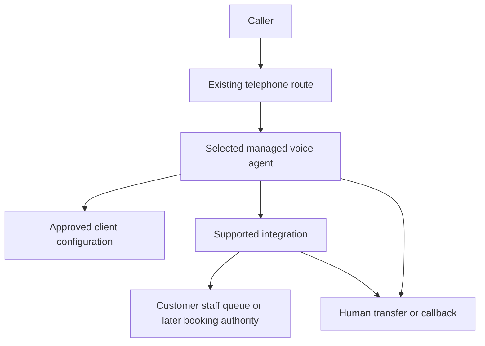

# TAKAVEN implementation architecture

Decision date: 2026-10-05. Retell remains the provisional mapping target; no provider or production integration has been selected. Gate B.1 mapping is recorded in [RETELL_GATE_B_MAPPING.md](RETELL_GATE_B_MAPPING.md) and resolves the prior route blocker at design level using Make API-key ingress and a minimal Make Data Store ledger.

## Product boundary

TAKAVEN Receptionist Standard is a vendor-neutral implementation package: approved knowledge, conversation behaviour, qualification rules, action contracts, structured handoff, outcome classification, QA evidence and deployment/handover method. The selected voice platform operates speech/model/turn-taking. Customer-owned provider accounts, telephone routing, calendar/CRM and data are preferred where supported and practical. A supported automation service connects them only when native integration is insufficient. No custom booking database, dashboard, voice runtime or universal adapter framework.

Each client has a versioned config and an explicit account/agent/destination binding. Start with separate customer deployments; a shared multi-tenant service is not required. Model arguments cannot choose the customer, credentials or integration endpoint. Ambiguous routing fails safely.

## Configuration and conversation

[config](../config/README.md) contains fictional draft automotive profiles for Mauritius and UAE; no approved customer information. Facts, service IDs, duration, prices, hours, holidays, languages, timezone, escalation and consent are explicit. The [offline lint](../scripts/validate_config.py) catches structure errors and dangerous policy changes. It neither exports vendor payloads nor deploys agents.

The [conversation policy](../spec/CONVERSATION_POLICY.md) supplies common semantic rules. Translate them minimally into the selected vendor's native configuration. Do not bind English/French/Arabic to separate agents unless the supported route preserves context and switching tests pass. No Kreol. Prompt injection cannot authorise an action; integration checks apply outside conversation.

## Appointment requests and later booking outcomes

[Action contracts](../spec/ACTION_CONTRACTS.md) separate an appointment request from a committed booking. The first demo captures the requested service, date/time window, caller and vehicle details, reads them back and records a staff/queue receipt. It does not claim availability or a booked slot. The existing scheduling authority and its availability/capacity controls are deferred until a customer-owned booking system is selected and tested.

The corrected first-demo receipt path is Retell custom function → HTTPS Make webhook authenticated with static `x-make-apikey` → minimal Make Data Store receipt/idempotency ledger → staff email plus one Google Sheet row → Make webhook-response receipt ID. The ledger uses trusted Retell `call_id` plus intent as its unique key, creates `PROCESSING` before downstream side effects, rejects changed payloads, returns original receipts for exact committed replays, and leaves uncertain work for reconciliation. Retell `X-Retell-Signature` remains optional defense-in-depth where raw-body verification is available. The Data Store is not a customer, CRM, booking or general-purpose database; no custom server is being added.

For the first demo, an unknown request-delivery outcome is reconciled against the staff/queue receipt before retry. Later, if a customer booking authority is added, classify a scheduling timeout as unknown until reconciliation establishes whether the operation committed. Never cancel the old appointment before a replacement is committed through an atomic supported change.

## Authentication and operations

Use supported provider/carrier verification over the original payload and a replay window where supported. Do not invent a common HMAC format or copy a provider-specific verifier. Require scoped customer-owned credentials, approved identity checks for lookup/change/cancel, and allowlisted actions. Caller ID is a contact hint. Simulator endpoints and keys stay isolated from production; missing production configuration is a blocking failure.

Tool deadlines must fit the selected vendor's documented timeout. Only supported safe retries; finite attempts, backoff and terminal/manual-review state. Unknown mutation outcomes require reconciliation. Notification delivery and human acknowledgement are different statuses. A generated summary cannot override action receipts.

Keep config/operation/call IDs and minimal diagnostic codes; redact secrets and caller data. Recordings default off in templates. Agree consent, retention and deletion with the client before launch. Use provider-native logs/alerts and existing staff inbox/CRM instead of building observability software.

## Release and handover

Validate locally; freeze config hash; snapshot the existing native configuration; review a target-specific change plan; apply using supported vendor tooling only after that stage is authorised; read back owned values and explicit removals; run acceptance; enable a monitored pilot with tested human rollback.

A local lint pass proves only config conformance. A vendor push proves only that the request was accepted. Neither proves correct booking, natural speech or launch readiness. [QA cases](../qa/README.md) define the separate evidence.

Phase 0 follow-up is complete for desk qualification. The next gate is the owner-approved execution plan: offline Retell mapping, route/access decisions and only then an authorised lean telephone test. Repositories do not select the winner.
