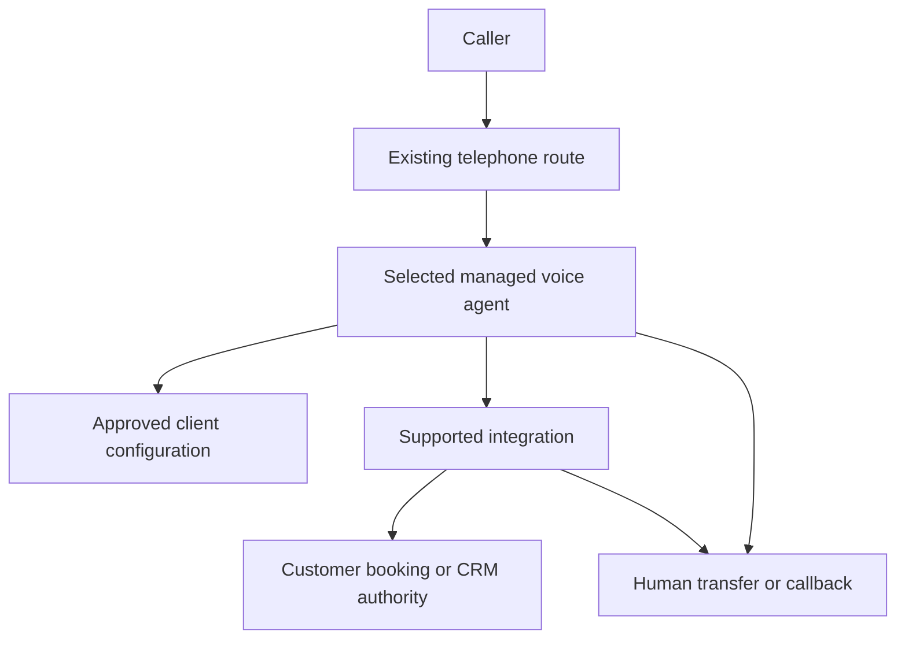

# TAKAVEN implementation architecture

Decision date: 2026-10-04. The source review informs this design; no provider or production integration has been selected.

## Product boundary

TAKAVEN sells a client-specific configuration, supported integrations, acceptance evidence and handover. The selected voice platform operates speech/model/turn-taking. Customer-owned telephone routing and existing calendar/CRM remain authoritative. A supported automation service connects them only when native integration is insufficient. No custom booking database, dashboard, voice runtime or universal adapter framework.

Each client has a versioned config and an explicit account/agent/destination binding. Start with separate customer deployments; a shared multi-tenant service is not required. Model arguments cannot choose the customer, credentials or integration endpoint. Ambiguous routing fails safely.

## Configuration and conversation

[config](../config/README.md) contains fictional draft automotive profiles for Mauritius and UAE; no approved customer information. Facts, service IDs, duration, prices, hours, holidays, languages, timezone, escalation and consent are explicit. The [offline lint](../scripts/validate_config.py) catches structure errors and dangerous policy changes. It neither exports vendor payloads nor deploys agents.

The [conversation policy](../spec/CONVERSATION_POLICY.md) supplies common semantic rules. Translate them minimally into the selected vendor's native configuration. Do not bind English/French/Arabic to separate agents unless the supported route preserves context and switching tests pass. No Kreol. Prompt injection cannot authorise an action; integration checks apply outside conversation.

## Booking and action outcomes

[Action contracts](../spec/ACTION_CONTRACTS.md) separate a request from a committed result. The existing scheduling authority owns capacity and rejects overlapping writes for both creation and rescheduling. An availability read is not a reservation. If supported integrations cannot prove this safety, take a booking request for human confirmation instead of promising a completed appointment.

Use a durable operation ID and stored payload digest/outcome. Same operation + same payload returns the original result; same operation + different payload conflicts. Distinct confirmed intentions receive new IDs even within one call. Do not use one call ID for all mutations or erase deduplication history when a booking is cancelled. Retention is client-approved.

After a timeout, classify outcome as unknown until reconciliation with the authority establishes whether the operation committed. Reconcile before retry; preserve the same ID. Never cancel the old appointment before a replacement is committed through an atomic supported change. If that is unavailable, route rescheduling to a human.

## Authentication and operations

Use supported provider/carrier verification over the original payload and a replay window where supported. Do not invent a common HMAC format or copy a provider-specific verifier. Require scoped customer-owned credentials, approved identity checks for lookup/change/cancel, and allowlisted actions. Caller ID is a contact hint. Simulator endpoints and keys stay isolated from production; missing production configuration is a blocking failure.

Tool deadlines must fit the selected vendor's documented timeout. Only supported safe retries; finite attempts, backoff and terminal/manual-review state. Unknown mutation outcomes require reconciliation. Notification delivery and human acknowledgement are different statuses. A generated summary cannot override action receipts.

Keep config/operation/call IDs and minimal diagnostic codes; redact secrets and caller data. Recordings default off in templates. Agree consent, retention and deletion with the client before launch. Use provider-native logs/alerts and existing staff inbox/CRM instead of building observability software.

## Release and handover

Validate locally; freeze config hash; snapshot the existing native configuration; review a target-specific change plan; apply using supported vendor tooling only after that stage is authorised; read back owned values and explicit removals; run acceptance; enable a monitored pilot with tested human rollback.

A local lint pass proves only config conformance. A vendor push proves only that the request was accepted. Neither proves correct booking, natural speech or launch readiness. [QA cases](../qa/README.md) define the separate evidence.

Phase 0 remains the next gate: verify the five candidate families, actual product identifiers, supported MU/UAE telephone paths, EN/FR/AR behavior, existing booking integrations, ownership/export and total operating cost. Repositories do not select the winner.
