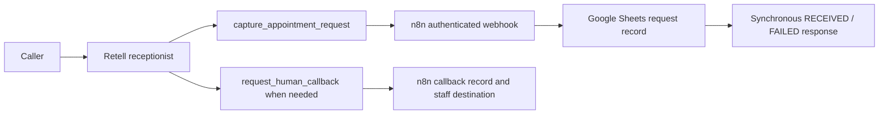

# TAKAVEN Receptionist architecture

Status: **active launch-preparation baseline**. Decision date: 2026-10-06.

## Active runtime



The known-good appointment path is:

```text
Retell
  -> dedicated capture_appointment_request
  -> n8n
  -> Google Sheets
  -> synchronous RECEIVED response
```

`RECEIVED` means that the request was sent to the team for confirmation. It is not a booking, reservation, availability result, staff acknowledgement or committed appointment.

## Product boundary

The current product is one concrete TAKAVEN Receptionist deployment. It answers approved FAQs, collects caller/service context, captures appointment requests, handles corrections, supports Mauritius English/French, and uses a truthful callback fallback. Each client receives a separate configuration and customer-owned account/credential binding. Sales and Admin/Support are deferred.

The system must not claim availability, booking, rescheduling, cancellation, customer lookup or live transfer unless a separately approved and proven capability exists.

## Configuration boundaries

- Business knowledge and approved facts live in a client configuration.
- Retell owns speech, turn-taking, language handling and the dedicated action contract.
- n8n owns the authenticated action endpoint, allowed-field mapping, Sheet append, callback record and synchronous response.
- Google Sheets is prototype/demo request storage, not a booking authority or CRM.
- Provider and n8n credentials remain in native credential stores, never in Git.
- Operational evidence uses provider/n8n execution records and the request/callback references; no dashboard is built.

## Authentication

The sanitised n8n templates use native Webhook header authentication backed by an owner-controlled n8n credential. Retell sends the matching static header from its function configuration. The template is ready for deployment, but customer-environment rejection and rotation evidence remain launch checks. See [LAUNCH_PREPARATION.md](LAUNCH_PREPARATION.md).

## Handoff and failure behaviour

When the caller asks for a human or the agent cannot safely complete the request, the agent captures name/contact/reason where possible, invokes the callback action, and says the team will follow up. It must not claim a live transfer. Action failure returns a truthful fallback; the agent does not invent a receipt.

## Superseded historical design

Earlier Gate 0A/Gate B material described a Retell → Make → Data Store/email/Sheet route. That work is preserved as historical evidence and decision provenance. It is **not** the active Receptionist implementation. The repository’s current runtime and launch documents take precedence.

## Shared-base labels

- `RECEPTIONIST-SPECIFIC`: automotive facts, appointment request fields, demo wording and customer deployment values.
- `FUTURE SHARED-BASE CANDIDATE`: provider integration conventions, native credential handling, allowed-field tool contracts, callback contract shape, operational evidence, QA and deployment checklists.

These candidates are not abstracted into a generic platform yet.
